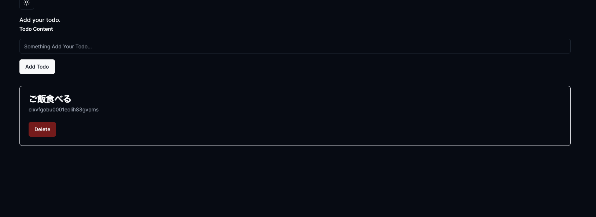
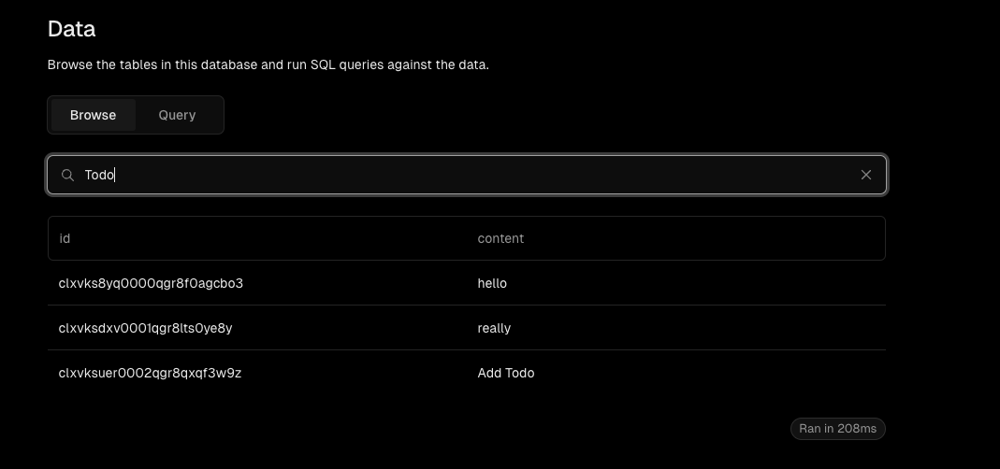
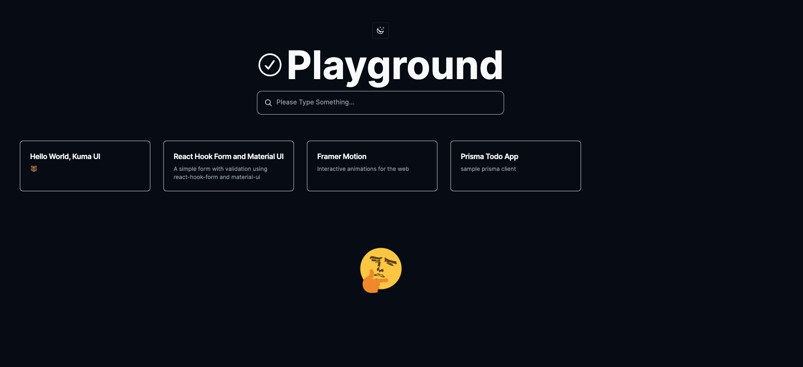

## TODO管理作った



PullRequest: <https://github.com/hulk510/playground/pull/615>

エンジニアになって5年。初めてまともに個人開発した気がする。

と言っても超簡単な作成、削除、表示くらいしかやってない。
基本的なことを改めてやってみると案外面白かったし形になってデザインがshadcn/uiで作ったおかげでスッキリしているから簡単なものでも嬉しさある。

nextjsのApp Routerで実装してみたんだけどこれが意外に難儀だった。
stateでの開発に慣れてるせいで、button clickした時にリクエストじゃなくて、htmlのformでactionを走らせるとかサーバーを挟むようになるだけで考え方が難しいなーって感じた。

今回[このドキュメント](https://nextjs.org/docs/app/building-your-application/data-fetching/server-actions-and-mutations)見ながらこんな感じの作成コードを書いた。
`'use server'`これを明記したactionを作れば勝手にサーバーのリクエストになるみたい。

```ts
// app/actions/todo.ts
'use server';
import { PrismaClient } from '@repo/db';

import { z } from 'zod';

const todoSchema = z.object({
  content: z.string().min(1),
});

export async function createTodo(prevState: unknown, formData: FormData) {
  const validatedFields = todoSchema.safeParse({
    content: formData.get('content'),
  });
  ...
  const prisma = new PrismaClient();
  await prisma.todo.create({
    data: {
      content: validatedFields.data.content,
    },
  });

  return {
    message: '',
  };
}

```

form側でこんな感じでrequest。
これでprismaにデータが登録される。（inputとかは普通なので省略）

```tsx
// app/ui/todo-form.tsx
    const [state, formAction] = useFormState(createTodo, initialState);
    ...
    <form
      action={async (formData: FormData) => {
        await formAction(formData);
      }}
    >
    ...
    </form>
```

正直なところ流し読みしすぎてちゃんとドキュメント読んでないので、あまりserver actionsに関してよくわかってない感ある。

ただ従来みたいにサーバーでの処理を実行する際に、APIを作らなくてもよくなったみたいなところなのかな？

それは便利かなーって気がする。

ちなみにdeleteに関してはbuttonのリクエストなのでstateを使った操作を行う必要があるかなーと思って、何も考えず`'use client'`をつけてリクエストしてみるとprismaはブラウザ環境では動かないことに気づいて焦ってた。onClickでやるには流石にAPI作らないとだめかなーと思ってたけど同じようにServerActionで動くみたい。（どうなってるんや）

```ts
// app/actions/todo.ts
export async function deleteTodo(id: string) {
  const prisma = new PrismaClient();
  await prisma.todo.delete({ where: { id } });
}
```

```tsx
// app/ui/todo-item.tsx
  const handleDelete = useCallback(async () => {
    try {
      await deleteTodo(todo.id);
    } catch {
      ...
    }
  }, [todo.id, toast]);
```

ただ、Deleteに関しては後述する本番で今動いてないので実際動いてるのかどうかは確認できてない。

## 本番では動いてなさそう

今回VercelのPostgresQLを使ってみて、登録自体は画像見たいな感じでできてるんだけどなぜか表示されないのである。



見た感じ登録はできてるんだけどなぜか表示されねぇ。

## その他やったこと

shadcn/uiでdarkモードに簡単に切り替えれるみたいなのでやってみた。


dark modeにするだけでいい感じにできるのはめっちゃいい。
shadcnは確かに便利ではあるんだけど、今のコンポーネントの書き方が変わってカスタマイズもしてしまってる場合取り込みがめんどくさそうだなーという感覚。

ただ、機能を持ったコンポーネントを簡単に作れるというのはサービス作る上では楽すぎるので好き。

## アニメーションやりてぇー

react-three-fiberやthree.jsを使って何か3Dアニメーションを作ってみたい。
そういうアニメーションってどこから始めたらいいかわかんないし、何ができるのかも想像できなすぎて敷居が高い。できるとサイトがリッチになるし、既存のライブラリの実装では実現できないアニメーションやインタラクションを実装できるのでいつかはやりたいなーって思った。

<iframe src="https://codesandbox.io/embed/cards-with-border-radius-9s2wd9?fontsize=14&hidenavigation=1&theme=dark"
     style="width:100%; height:500px; border:0; border-radius: 4px; overflow:hidden;"
     title="Cards with border radius"
     allow="accelerometer; ambient-light-sensor; camera; encrypted-media; geolocation; gyroscope; hid; microphone; midi; payment; usb; vr; xr-spatial-tracking"
     sandbox="allow-forms allow-modals allow-popups allow-presentation allow-same-origin allow-scripts"
   ></iframe>

こういうのできたらめっちゃ楽しそう。

codesandboxこうやって埋め込んだりできるからいいよねー。

まぁでもまずは基礎をおさらいしたいから、今後はMDNのドキュメント見ながらHTML、CSS、 JavaScriptのおさらいをやっていこうかなー。
