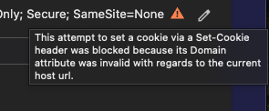
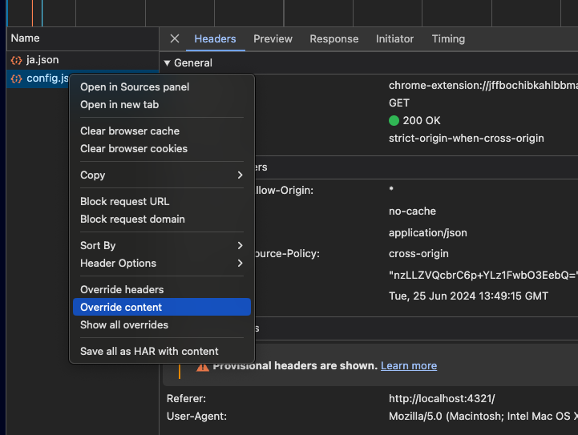
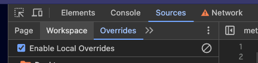

## Devtoolはやっぱり優秀すぎる

開発でCookieがなぜかブラウザに保持されず、chromeのdevtoolでnetworkタブ開いて確認したんだけど最初は何がエラーなのか謎だった。

<figure>
    
    <figcaption>devtoolでset-cookieに表示されるエラーアイコンをホバーするとエラーメッセージが表示される
    </figcaption>
</figure>

最初はホバーしてエラーメッセージが出るって知らなくて画像にあるエラーアイコンだけが表示されていて意味不明な状態だった。
数秒ホバーして少し待ったらニョキって出てきてDomainが悪いよー！ってエラーを無事見つけれた。

しかし、いざDomainを変えてテストするとなると、いちいちソースを修正して検証環境にデプロイし直すのがめんどくさい。

<!-- 1 つ目の脚注 [^footnote1] -->
<!-- [^footnote1]: これは 1 つ目の脚注です。1 つ目の脚注のつづき -->

そんな時に便利なのが、**Devtoolでのresponse override！**

詳しくは、chromeのドキュメント「[ウェブコンテンツとHTTPレスポンスヘッダーをローカルでオーバーライドする](https://developer.chrome.com/docs/devtools/overrides?o=1&hl=ja)」を読んでほしい。

簡単にまとめると、特定のレスポンスをMockしたデータに書き換えて再度アクセスした際にそのデータにした状態でレスポンスを返してくれる。そのため今回みたいなDomainを適当なものに変えてブラウザが正しくCookieを保持してくれるかをブラウザ上で確認できるのである。

## 使い方



アクセス方法はいろいろあるんだけどレスポンスを右クリックすると「Override headers」「Override content」ってのがあるのでこれをクリックすると開始できる。
するとそのモックしたデータを保存する場所を聞かれるので適当なフォルダにおいておけばあとは自由にresponseをモックすることができる。

モックしているとデータがずっとモックされてしまうので、消したい場合はSourcesタブにアクセスしてOverridesの項目からEnable Local Overridesの右にある停止マークみたいなのを押すと消すことができるよ。


## 感想

Domainをオーバーライドしてみるとブラウザーに保存されてることが確認できて、思ったより早く検証することができたのでよかったら使ってみるのがいいかも！
バックエンドの修正等必要なく動かせるし。

ちょっと気になったのはレスポンスに応じてJavaScriptの操作を変える処理が含まれている場合、レスポンスのパラメータを変えることで実は見れないUIがアクセスされたりはしないのだろうか？

簡単にこのパラメーターがtrueの時しか見えない画面をjsで制御していたりするとそのAPIの値を変えてみたりってのが実現できそうな感じが合って気になった。

```text
とはいえ、jsのソースをいじったりしても同じことが言えるのか
データ自体がAPIから返却されているのであれば、トークンで返すか判断しているだろうしあまり問題にはならないかな？
```

まぁ暇だったらいつかいろいろ触ってみたいと思う。
DevToolはまだまだ知らない面白さがいろいろありそうだし、ちゃんと使えるようになるとWeb開発で役立つからぜひマスターしたいなと思った。
