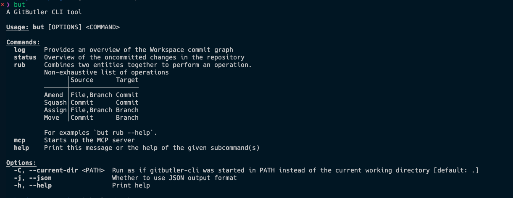

## 背景と課題

MacBook AirとMac miniを使い分けながら開発しているが、基本的にはMac miniで作業している。最近はAIを使った開発が増えてきて、コミットを整理するよりも複数の作業を並行して進めるためにGitButlerを使うようになった。

今回、MacBook AirからMac miniで作業中のプロジェクトを進めたくて、VSCode Remote SSHを使って作業してみようと設定したが、GitButlerはGUIベースのツールなので、リモート環境でどうやってコミットすればいいか分からない状況になった。

## 主な問題点

### 1. GitButlerのブランチ管理

GitButlerで管理されているプロジェクトでは、ブランチが`gitbutler/workspace`のような形式になっており、通常のgitコマンドでコミットできるかが不明。

### 2. GUI依存の操作

GitButlerは基本的にGUIから操作するツールなので、SSHでリモート接続している環境では操作が困難。

### 3. 回避策の検討

- 一旦remoteにpushしてから他のマシンで作業を継続
- コミットせずに作業だけ進める
- 普通のgitにcheckoutして作業（但しこれならローカルで作業すれば良い）

## 解決策の調査

### GitHubでのディスカッション

VSCode Remote SSHでGitButlerを使いたいという要望は、GitHubの[Discussion #2628](https://github.com/gitbutlerapp/gitbutler/discussions/2628)で上がっているが、現時点では明確な進展はない様子。

### CLIツールの存在

Discussionに私もコメントをしたらすぐに返信をくれて、GitButlerには`but`というCLIツールが存在することが分かった。現在は`but rub`コマンドでamendやsquashができるが、新しいコミットの作成については制限があるみたい。

## CLIツールのインストール方法

### 1. Experimental機能の有効化

Global SettingsのExperimentalで「GitButler Actions」を有効にする。

### 2. CLIのインストール

有効化すると、Global SettingsのGeneralにCLIインストール用のボタンが表示される。

### 3. インストール結果

ボタンを押すとインストールが完了する。ボタンの反応が分かりにくい場合があるが、実際にはインストールが進行している。

## コントリビューターとの会話から得られた情報

### 現在の機能

- `but rub`コマンドで既存のコミットに対するamendが可能
- 新しいコミットの作成は現在制限されている
- 共有ディスクがあれば、GUI以外の環境でもコミット操作が可能

### 将来の展望

- GitButlerがブランチをより自然にフォローできるようになる予定
- 通常のgitコマンドとの互換性向上を目指している
- 侵襲性を最小限に抑える方向で開発が進んでいる

## 今後の試行予定

`but`コマンドは現在インストール済みだが、実際の使用はまだ試していない。リモート環境でのワークフローで実際に使ってみて、どの程度実用的かを検証する予定。

特に以下の点を確認したい：

- 特定のスタックに対してamendする際の操作感
- リモート環境でのパフォーマンス
- 既存のGitButlerワークフローとの整合性

## まとめ

GitButlerでのリモート開発は現在進行中の課題だが、CLIツールの存在により部分的な解決策は提供されている。完全な解決にはまだ時間がかかりそうだが、開発チームも積極的に改善に取り組んでいる様子。

今後は実際に`but`コマンドを使った開発ワークフローを試して、実用性を検証していきたい。
