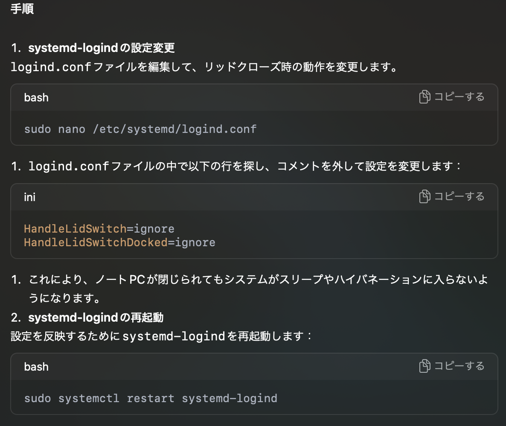

## 中々進まないArch Linux

去年の夏くらい（？）にエンジニアたるもの遊べるサブ機を持ってる方がかっこいいと思ったことから、ThinkPadをハードオフで7000円くらいで購入してみた。

> エンジニア歴6年くらいなので、そろそろLinuxを入れて自分でカスタムしてみたりってエンジニアっぽいことを始めてみたかったんです。

LinuxはvirtualBoxやdocker等で触ることはあれど実機に入れてみたりはなかったので、買って来るなりwindows吹っ飛ばしてArch Linuxにしてみました。

インストールもやったことないので案の定詰まりましたが、まぁなんとか入れることができました。そんな喜びも束の間、そこから今まで何も手をつけず放置していました。

_何を隠そう、日本語が豆腐になって表示されていなかったり、ThinkPadのキーボードが日本語配列だったり、操作不明すぎてまともに触れていなかったのです。_

Archがいいぞと聞きチャレンジしてみた私の浅はかさ。（Ubuntuなどメジャーなものからやればよかったと後悔）

Linux初心者からするとあれもこれも入れなきゃならんし、日本語変換するにも設定が必要でもはや何をすれば良いのかわからん状態で最初にやるにはだいぶハードでした笑（ハードって書いてあるけどやってみたくなるよね⭐️）

もう一つ言い訳として触れる時間が夜なんですが、触ってると娘にキーボードの上に乗りたいと踏みつけられたりPCを閉じられたりとまともに触れたもんじゃなかったので完全にやる気をへし折られていました。

## Linuxやりたい熱が再来

最近なんか基礎を改めてやり直そうみたいなのが自分の中で流行っていて、それで「せっかく買ったんだしLinuxに関してもサーバーの知識をつけたいし何よりArch Linux使えますってギーク感を私も欲しいよなー」とどうにかできんものかーと思ってたところ、

よく考えればSSHすればいいのでは？と閃めきました。


こんな感じで表示できるようになったよ。（ええ感じ）

なんか逃げな気もしますが、OSは触りやすくなったしよしとしよう！

ということで適当にやってきたことなんかを残していこうかなというのが今回の主題です。

## My ThinkPadにSSHできるように設定していく

やったこと自体は多分普通のサーバーの設定と同じような感じでできたかなーという体感です。

パッケージの管理はyayを使いました。

### SSHクライアントの導入

とりあえずSSHクライアントを入れる。

```bash
yay -S openssh
# 入れた後クライアントの起動
sudo systemctl enable sshd.service
sudo systemctl start sshd.service
```

### 設定ファイル変更

```bash
sudo vi /etc/ssh/sshd_config
```

`/etc/ssh/sshd_config`のファイル修正して以下のあたりの設定追加。

```bash:/etc/ssh/sshd_config
PubkeyAuthentication yes
PasswordAuthentication no
```

### ufwの設定

あんまりわかってないけどファイアーウォールの設定。

```bash
yay -S ufw # install
# ... installed!!

# 自動で起動するように設定
sudo systemctl enable ufw
sudo systemctl start ufw

# ufwの設定
sudo ufw default deny incoming # リクエスト全部deny
sudo ufw default allow outgoing # 出ていくのは全許可
sudo ufw allow from 192.168.1.0/24 to any port 22 # ワイのPCで使ってるIPのサブネットは22ポートアクセス許可あたりを設定

# 設定反映
sudo ufw enable
```

おそらくこれで家のWi-Fiハッキングされない限りアクセスできないはず（だよね...？）試してみてないしどう試せば良いものかもわからん。

> グローバルIPからアクセスしてみたりとかするのかな？

そもそもローカルIPだしいいやって思ってるけど、あんまりまだそこらへんのネットワーク知識ないからミスってる可能性アリエールだけど一旦放置。

### 接続先となるIPの取得

ユーザーはログインユーザーで使ってるものでログインするようにした。新しく作ってもよかったけど自分しか使わないしええかなというところ、後なんかだるかったのでやめた。

ipアドレスを確認して控えておく。

```bash
ip route # ipアドレスの確認
```

### 別PC作業

SSHに使う鍵をいつしかの時に使ったコマンドで適当に作成。（fzfの検索いい感じ）。

```bash
ssh-keygen -C "$(whoami)@$(uname -n)-$(date -I)" -t ed25519
```

デフォルトの名前はすでに使ってたので適当な名前にして保存。
いつも忘れるので先に`~/.ssh/config`に設定書いておく。

```bash
HOST MY_PC
  HostName 192.168.1.48 # 控えといたIP
  IdentityFile ~/.ssh/my_awesome_pc_key # 作成した鍵
  User haruka
  Port 22
```

あとはワイのMacからSSHするだけ。

```bash
ssh MY_PC
```

完了ー！

## 番外編

### せっかくなので固定IPにしてみる

Wi-FiだとIPが変わる可能性があり、今のままだと接続する際にめんどいことになる気がします。

そういうめんどくささは早めに潰しておきたいタイプなので、固定IP設定してみました。

幸い家で契約しているWi-Fiの管理画面で固定IPをMacアドレス指定すれば簡単にできそうだったので設定。

設定してルーターを再起動した後、

```bash
sudo ip link set wlan0 down
sudo ip link set wlan0 up
```

IPを再設定？して設定されてるかip routeでipを確認。

> ちなみにちょっとやってみたかったので適当な固定IPを指定してみたんですがipアドレスちゃんと設定したものに変わってて、管理画面とか触って設定したのギーク感感じられてワクワクしました。（現場からは以上です）

### 閉じててもアクセスできるように設定

今の状態だとPCがスリープされるとアクセスできなくなり、毎回PC起動したりするのだるかったので設定方法を調べました。

というかここに時間使うほどでもないかなと思った（探すのめんどかったので）のでChatGPTに聞きました。



とのことです間違っている可能性あるけど、動いたので一旦ヨシ！

スリープにしててもPCバリバリ稼働って感じになってるけどまぁええでしょう。

### これでNeoVimはじめれるぞ

ずっとNeoVimに移行しようしようと中々自分のメイン機で作業しながらやるのもモチベが上がらなかったが、Linuxを触りながらさらに自分だけのカスタムしたイケイケなNeoVimを使ってウハウハしていきたいと思います。

ちなみにまだ豆腐文字消えてなかったり、Dot filesがちゃんと設定できてなくてログイン時にエラー出ますがそれらもちまちまやってく予定。

## iPadでも快適にできる環境を求めたい説ある

娘と一緒にいるとどうしてもPCをがっつり触れる時間があまりないが、とはいえ寝てるタイミングちょこちょこあるので、そういう時にiPadとか軽い端末でSSHしてみたり、VSCodeのCodeSpacesとかで開発してみたりとかやっていけたら楽しそうだなーと思えたいい経験だった。

ちょっとしたソース修正とかだったらGithub AppのEditでなんとかなるしそういう感じでどこでもどのデバイスでも自分がアクセスしたいところにアクセスできるようにしておくの今後もちょくちょくやっていきたいなと思うのであります。
